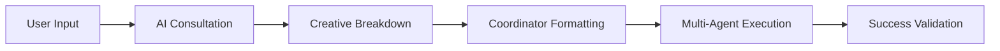

# Enhanced HelperAgent - AI-Powered Task Decomposition 🤖

## 🚀 Revolutionary Upgrade

The **Enhanced HelperAgent** now features **AI consultation** and **coordinator-compatible formatting**, transforming simple task descriptions into intelligent, executable plans that integrate seamlessly with the multi-agent system.

## ✨ New AI-Enhanced Features

### 🧠 AI Best Practices Consultation
- **Intelligent Project Detection**: Automatically identifies project types (web, mobile, API, data science)
- **Technology Stack Analysis**: Recognizes frameworks and technologies from descriptions
- **Creative Task Breakdown**: Generates sophisticated subtasks using AI insights
- **File Structure Recommendations**: Provides industry-standard project structures

### 🎯 Coordinator Integration
- **Perfect Compatibility**: Tasks formatted exactly as CoordinatorAgent expects
- **Proper Task Types**: Matches coordinator's delegation patterns (`file_management`, `code_generation`, etc.)
- **Agent Assignment**: Automatic assignment to correct specialized agents
- **Workflow Ready**: Immediate execution through coordinator workflows

## 🔥 Live Demo Results

### Input: `"Create a todo app with React frontend and Node.js backend"`

**AI Consultation Results:**
```
Project Type: web_development
Technologies: react, node.js
Recommended Structure: 7 phases
AI File Structure: ✅ Generated
Creative Breakdown: ✅ 8 insights
```

**Generated Coordinator-Compatible Tasks:**
1. `[researcher]` Research modern web development frameworks *(research)*
2. `[file_manager]` Set up AI-recommended file structure *(file_management)*
3. `[coder]` Design component architecture and UI mockups *(code_generation)*
4. `[coder]` Set up development environment with build tools *(code_generation)*
5. `[coder]` Create responsive frontend components *(code_generation)*
6. `[coder]` Implement backend API with route handling *(code_generation)*
7. `[code_rewriter]` Integrate database with optimized queries *(code_rewrite)*
8. `[tester]` Add comprehensive testing suite *(testing)*
9. `[git_manager]` Configure deployment pipeline *(git_management)*

## 🎨 AI Knowledge Base

### Supported Project Types
| Project Type | Technologies | Specialized Breakdown |
|-------------|-------------|----------------------|
| **Web Development** | React, Node.js, Express, Next.js | Frontend/backend separation, responsive design, API integration |
| **Mobile Development** | React Native, Flutter, Swift | Platform guidelines, offline functionality, device APIs |
| **API Development** | FastAPI, Express, Django, Flask | RESTful design, authentication, documentation, rate limiting |
| **Data Science** | Python, Pandas, TensorFlow, PyTorch | Data pipelines, modeling, visualization, MLOps |

### Creative Task Generation
The AI consultation generates sophisticated, context-aware subtasks:

```python
# Example for API Development
[
    "Design RESTful API architecture with proper resource modeling",
    "Set up project structure with industry-standard organization", 
    "Implement authentication and authorization middleware",
    "Create data validation and sanitization layers",
    "Add comprehensive error handling and logging",
    "Generate API documentation with interactive examples"
]
```

## 🛠️ Enhanced API

### Core Methods

#### `consult_ai_best_practices(description: str) -> Dict[str, Any]`
**New!** Simulates AI model consultation for creative task breakdown.

```python
consultation = helper.consult_ai_best_practices("Build a REST API")
# Returns: project_type, technologies, file_structure, creative_breakdown
```

#### `format_task_for_coordinator(subtask_description: str) -> Dict[str, Any]`
**New!** Formats tasks exactly as CoordinatorAgent expects.

```python
formatted_task = helper.format_task_for_coordinator(
    "Create user authentication system"
)
# Returns: {description, task_type, assigned_to, coordinator_ready: True}
```

#### `decompose_task(description: str) -> List[Dict[str, Any]]`
**Enhanced!** Now uses AI insights for superior task breakdown.

```python
subtasks = helper.decompose_task("Create mobile app")
# Each subtask is coordinator-compatible with AI enhancements
```

## 🎯 Coordinator Compatibility Matrix

| Task Keywords | Coordinator Task Type | Assigned Agent | Auto-Generated |
|--------------|----------------------|----------------|----------------|
| `file`, `directory`, `organize` | `file_management` | `file_manager` | ✅ |
| `code`, `implement`, `develop` | `code_generation` | `coder` | ✅ |
| `review`, `quality`, `analyze` | `code_review` | `code_reviewer` | ✅ |
| `git`, `commit`, `version` | `git_management` | `git_manager` | ✅ |
| `test`, `testing`, `unit` | `testing` | `tester` | ✅ |
| `research`, `find`, `investigate` | `research` | `researcher` | ✅ |
| `fix`, `refactor`, `improve` | `code_rewrite` | `code_rewriter` | ✅ |

## 📊 Intelligent Success Criteria

The enhanced system generates context-aware success criteria:

### Generic Criteria
- All subtasks completed successfully
- No critical errors or failures
- Coordinator agents executed delegated tasks

### AI-Enhanced Criteria (Project-Specific)
**Web Development:**
- Frontend components are responsive and accessible
- Backend API follows RESTful best practices
- React components follow hooks and modern patterns

**Mobile Development:**
- App follows platform-specific design guidelines
- Performance optimized for mobile devices
- Offline functionality works as expected

**API Development:**
- Endpoints are properly documented
- Authentication and security implemented
- Rate limiting and error handling in place

## 🧪 Testing the Enhanced Features

### Quick Test
```bash
python3 test_enhanced_helper.py
```

### AI Variety Test
```bash
python3 test_ai_variety.py
```

### Interactive Demo
```bash
python3 helper_demo.py interactive
```

## 💡 Advanced Features

### AI File Structure Generation
Automatically creates project-appropriate file structures:

```python
# Web Development Structure
{
    'frontend/': ['src/', 'components/', 'pages/', 'styles/'],
    'backend/': ['routes/', 'models/', 'controllers/', 'middleware/'],
    'root': ['package.json', 'README.md', '.env']
}
```

### Intelligent Time Estimation
AI-based time estimates consider:
- Task complexity from AI analysis
- Technology stack complexity
- Project type characteristics
- Industry best practices

### Risk Assessment Enhancement
Enhanced risk detection includes:
- Multi-agent coordination complexity
- Technology stack conflicts
- Project scope creep indicators
- Deployment complexity factors

## 🌟 Benefits of AI Enhancement

✅ **Smarter Planning**: AI insights create more realistic and comprehensive plans  
✅ **Industry Standards**: Follows modern development best practices automatically  
✅ **Coordinator Ready**: Zero additional formatting needed for execution  
✅ **Context Aware**: Understands project types and generates appropriate tasks  
✅ **Creative Intelligence**: Goes beyond simple keyword matching  
✅ **Scalable Architecture**: Easily extensible for new project types  
✅ **Professional Quality**: Enterprise-grade task decomposition  

## 🔄 Integration Workflow



The Enhanced HelperAgent transforms the multi-agent system from a simple task delegator into an **intelligent project orchestrator** that thinks creatively and executes professionally! 🎯